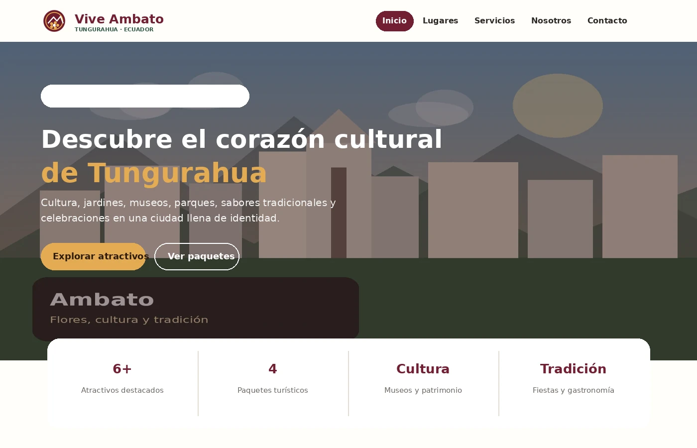

# Vive Ambato

## Nombre del proyecto
**Vive Ambato – Portal web de una Agencia de Turismo**

## Nombre del estudiante
**Britany Lisseth Olivo Mendieta**

## Destino turístico asignado
**Ambato – Tungurahua, Ecuador**

## Descripción del proyecto
Vive Ambato es una agencia turística ficticia creada para promocionar los principales atractivos culturales, parques, museos, espacios naturales, gastronomía y eventos de la ciudad de Ambato. El sitio cuenta con cinco páginas HTML y un diseño adaptable a computadora, tablet y teléfono móvil.

## Tecnologías utilizadas
- HTML5
- CSS3
- Flexbox
- CSS Grid
- Media Queries
- Git
- GitHub
- GitHub Pages

## Captura del sitio

## URL del repositorio
`https://github.com/TU-USUARIO/examen-final-turismo`

## URL del sitio publicado
`https://TU-USUARIO.github.io/examen-final-turismo/`

> Antes de entregar, reemplazar `TU-USUARIO` por el nombre de usuario real de GitHub.

## Investigación turística
El contenido se elaboró tomando como referencia información turística del GAD Municipalidad de Ambato y del portal turístico de Tungurahua, especialmente sobre Atocha-La Liria, museos, quintas, parques y patrimonio local.
